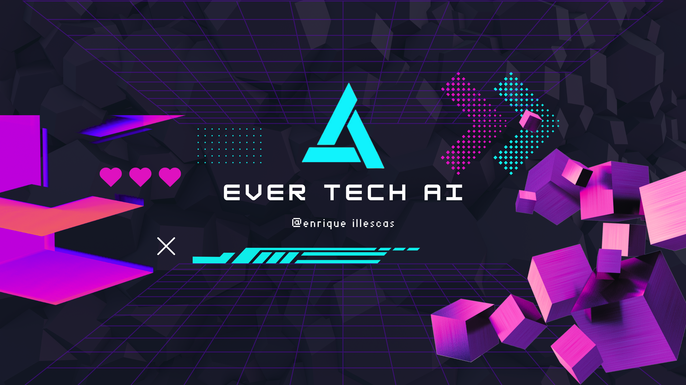

# chatbot ia EVERTECH

Este proyecto de inteligencia artificial se enfoca en desarrollar un sistema de reconocimiento de objetos utilizando redes neuronales convolucionales (CNN). El objetivo principal es crear un modelo capaz de identificar una amplia variedad de objetos en imágenes con alta precisión.

## Descripción del Proyecto de ia

El proyecto utiliza el conjunto de datos chatgpt(open AI) para entrenar la red neuronal. Se implementará una arquitectura de red profunda, como ResNet o Inception, y se entrenará utilizando técnicas de aprendizaje supervisado.Las respuestas generalmente seran acuerdo a tecnologias de desarrolo o programacion.

## Ejemplos de Enlaces

- [Sitio web oficial de Open ai](https://openai.com/api/)
- [Artículo sobre Redes Neuronales Convolucionales](https://www.tensorflow.org/tutorials/images/cnn)

##  Referencial




### Instalación

1. Clona el repositorio

   ```sh
   git clone https://github.com/EnriqueIllexas/chat-bot.git
   ```

2. Instala los paquetes de NPM

   ```sh
   pnpm install
   ```

3. Ejecuta el proyecto
   - Base de datos remota (necesario linkear con proyecto de Astro Studio)

   ```sh

   pnpm run dev
   ```

   - Base de datos local

   ```sh

   pnpm run start
   ```

## 🛠️ Herramientas que se usaron

- [![Astro][astro-badge]][astro-url] - The web framework for content-driven websites.
- [![Typescript][typescript-badge]][typescript-url] - JavaScript with syntax for types.
- [![Tailwind CSS][tailwind-badge]][tailwind-url] - A utility-first CSS framework for rapidly building custom designs.
- [![@midudev/tailwind-animations][animations-badge]][animations-url] - Easy peasy animations for your Tailwind project.

[astro-url]: https://astro.build/
[typescript-url]: https://www.typescriptlang.org/
[tailwind-url]: https://tailwindcss.com/
[animations-url]: https://tailwindcss-animations.vercel.app/
[astro-badge]: https://img.shields.io/badge/Astro-fff?style=for-the-badge&logo=astro&logoColor=bd303a&color=352563
[typescript-badge]: https://img.shields.io/badge/Typescript-007ACC?style=for-the-badge&logo=typescript&logoColor=white&color=blue
[tailwind-badge]: https://img.shields.io/badge/Tailwind-ffffff?style=for-the-badge&logo=tailwindcss&logoColor=38bdf8
[animations-badge]: https://img.shields.io/badge/@midudev/tailwind-animations-ff69b4?style=for-the-badge&logo=node.js&logoColor=white&color=blue
[contributors-shield]: https://img.shields.io/github/contributors/midudev/la-velada-web-oficial.svg?style=for-the-badge
[contributors-url]: https://github.com/midudev/la-velada-web-oficial/graphs/contributors
[forks-shield]: https://img.shields.io/github/forks/midudev/la-velada-web-oficial.svg?style=for-the-badge
[forks-url]: https://github.com/midudev/la-velada-web-oficial/network/members
[stars-shield]: https://img.shields.io/github/stars/midudev/la-velada-web-oficial.svg?style=for-the-badge
[stars-url]: https://github.com/midudev/la-velada-web-oficial/stargazers
[issues-shield]: https://img.shields.io/github/issues/midudev/la-velada-web-oficial.svg?style=for-the-badge
[issues-url]: https://github.com/midudev/la-velada-web-oficial/issues