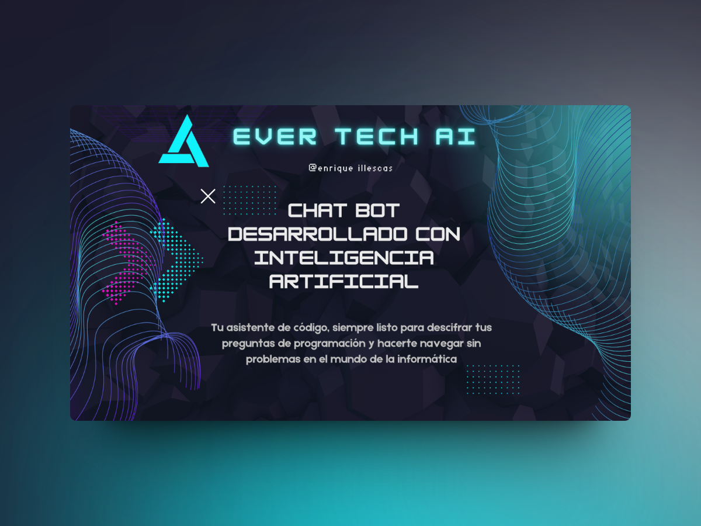

# chatbot ia EVERTECH

Este proyecto de inteligencia artificial se enfoca en desarrollar un sistema de reconocimiento de objetos utilizando redes neuronales convolucionales (CNN). El objetivo principal es crear un modelo capaz de identificar una amplia variedad de objetos en imágenes con alta precisión.

## Descripción del Proyecto de ia

El proyecto utiliza el conjunto de datos chatgpt(open AI) para entrenar la red neuronal. Se implementará una arquitectura de red profunda, como ResNet o Inception, y se entrenará utilizando técnicas de aprendizaje supervisado.Las respuestas generalmente seran acuerdo a tecnologias de desarrolo o programacion.

## Ejemplos de Enlaces

- [Sitio web oficial de COCO](http://cocodataset.org/)
- [Artículo sobre Redes Neuronales Convolucionales](https://www.tensorflow.org/tutorials/images/cnn)

## Imagen Referencial



### Instalación

1. Clona el repositorio

   ```sh
   git clone https://github.com/midudev/la-velada-web-oficial.git
   ```

2. Instala los paquetes de NPM

   ```sh
   pnpm install
   ```

3. Ejecuta el proyecto
   - Base de datos remota (necesario linkear con proyecto de Astro Studio)

   ```sh

   pnpm run dev
   ```

   - Base de datos local

   ```sh

   pnpm run start
   ```
